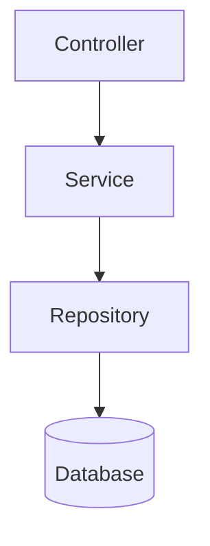
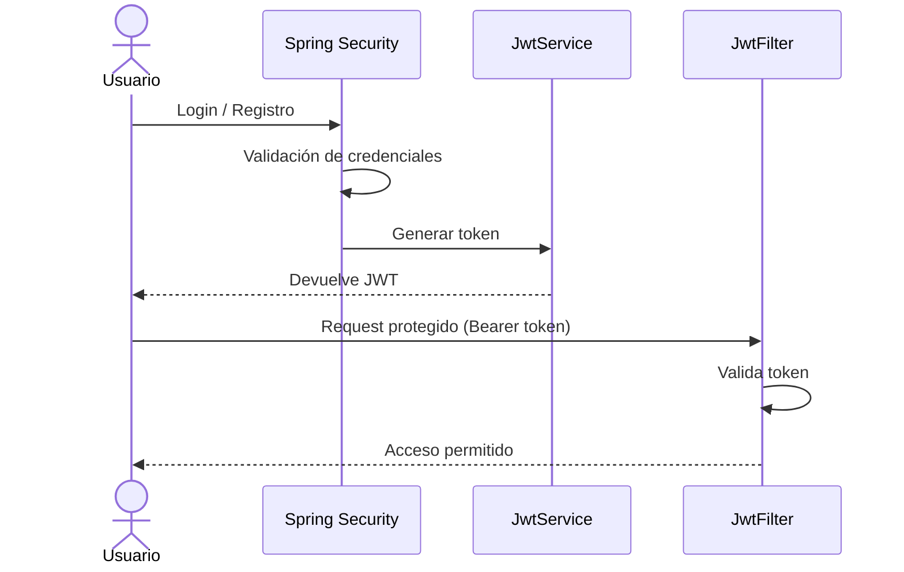
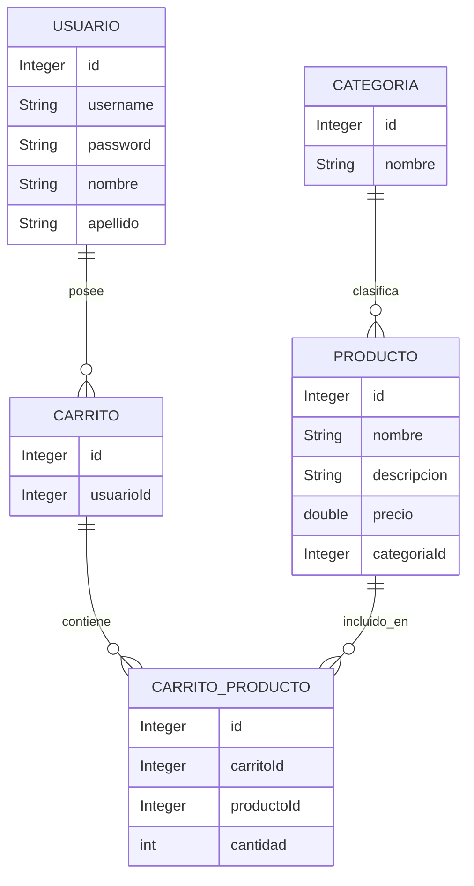

<div align="center">

# 🌱 Productos Ecológicos - Spring Boot API

**API REST para gestionar un catálogo de productos ecológicos, categorías, usuarios y carrito de compras.**

Implementa autenticación JWT, seguridad con Spring Security, persistencia con JPA/Hibernate y documentación interactiva con Swagger/OpenAPI.


</div>

---

## 📑 Tabla de contenidos

- [Tecnologías utilizadas](#-tecnologías-utilizadas)
- [Arquitectura del proyecto](#-arquitectura-del-proyecto)
- [Organización de paquetes](#-organización-de-paquetes)
- [Seguridad JWT](#-seguridad-jwt)
- [Autenticación](#-autenticación)
- [Swagger / OpenAPI](#-swagger--openapi)
- [Módulos disponibles](#-módulos-disponibles)
- [Modelo de datos](#-modelo-de-datos)
- [Configuración del proyecto](#️-configuración-del-proyecto)
- [Ejecutar proyecto](#️-ejecutar-proyecto)
- [Validaciones y manejo de errores](#-validaciones-y-manejo-de-errores)
- [Autor](#-autor)

---

## 🚀 Tecnologías utilizadas

### Backend

| Tecnología | Uso |
|---|---|
| **Java** | Lenguaje principal |
| **Spring Boot 4** | Framework de la aplicación |
| **Spring Security** | Seguridad y control de acceso |
| **JWT (JSON Web Token)** | Autenticación basada en tokens |
| **Spring Data JPA** | Capa de persistencia |
| **Hibernate ORM** | Mapeo objeto-relacional |
| **MySQL** | Base de datos |
| **Maven** | Gestión de dependencias y build |
| **Lombok** | Reducción de código repetitivo |
| **Bean Validation** | Validación de datos |
| **Swagger / OpenAPI** | Documentación interactiva de la API |

---

## 🏗 Arquitectura del proyecto

El proyecto utiliza una **arquitectura por capas**:



---

## 📂 Organización de paquetes

```
src/main/java/com/techlab/productos_ecologicos
│
├── auth
│   ├── AuthController
│   └── AuthService
│
├── config
│   └── SecurityConfig
│
├── controller
│   ├── ProductoController
│   ├── CategoriaController
│   └── CarritoController
│
├── dto
│   └── Objetos de transferencia de datos
│
├── exception
│   ├── Excepciones personalizadas
│   └── GlobalExceptionHandler
│
├── jwt
│   ├── JwtService
│   └── JwtFilter
│
├── mapper
│   └── Conversión Entity ↔ DTO
│
├── models
│   └── Entidades JPA
│
├── repository
│   └── Interfaces Spring Data JPA
│
└── services
    └── Lógica de negocio
```

---

## 🔐 Seguridad JWT

El sistema utiliza autenticación basada en tokens JWT.

### Flujo de autenticación



---

## 👤 Autenticación

### Registrar usuario

```
POST /auth/register
```

**Ejemplo de request:**

```json
{
  "username": "usuario1",
  "password": "123456",
  "nombre": "Alan",
  "apellido": "Contreras"
}
```

**Respuesta:**

```json
{
  "success": true,
  "message": "Usuario registrado correctamente.",
  "data": {
    "token": "JWT_TOKEN",
    "username": "usuario1",
    "role": "USER"
  }
}
```

### Login

```
POST /auth/login
```

**Ejemplo de request:**

```json
{
  "username": "usuario1",
  "password": "123456"
}
```

---

## 📚 Swagger / OpenAPI

La documentación interactiva está disponible en:

```
http://localhost:8080/swagger-ui/index.html
```

Swagger permite:

- ✅ Consultar endpoints
- ✅ Ver modelos DTO
- ✅ Ejecutar pruebas
- ✅ Autenticarse mediante JWT

### Autorizar JWT

1. Ejecutar login.
2. Copiar el token recibido.
3. Presionar **Authorize 🔒**.
4. Ingresar: `Bearer TU_TOKEN`

---

## 📦 Módulos disponibles

### 🛍️ Productos

Permite administrar el catálogo ecológico.

| Método | Endpoint | Descripción |
|---|---|---|
| `GET` | `/productos` | Listar todos los productos |
| `GET` | `/productos/{id}` | Obtener un producto por ID |
| `POST` | `/productos` | Crear un nuevo producto |
| `PUT` | `/productos/{id}` | Actualizar un producto |
| `DELETE` | `/productos/{id}` | Eliminar un producto |

### 🏷️ Categorías

| Método | Endpoint | Descripción |
|---|---|---|
| `GET` | `/categorias` | Listar todas las categorías |
| `GET` | `/categorias/{id}` | Obtener una categoría por ID |
| `POST` | `/categorias` | Crear una nueva categoría |
| `PUT` | `/categorias/{id}` | Actualizar una categoría |
| `DELETE` | `/categorias/{id}` | Eliminar una categoría |

### 🛒 Carrito

El carrito está asociado al usuario autenticado.

| Método | Endpoint | Descripción |
|---|---|---|
| `GET` | `/carritos/mi-carrito` | Ver el carrito actual |
| `GET` | `/carritos/mi-carrito/resumen` | Ver resumen del carrito |
| `POST` | `/carritos/productos/{productoId}` | Agregar producto al carrito |
| `PUT` | `/carritos/productos/{productoId}/descontar` | Descontar unidad de un producto |
| `DELETE` | `/carritos/productos/{productoId}` | Eliminar producto del carrito |
| `DELETE` | `/carritos/mi-carrito/vaciar` | Vaciar el carrito |

---

## 🗄 Modelo de datos

Relaciones principales entre entidades:



---

## ⚙️ Configuración del proyecto

Crear el archivo `application.properties`:

```properties
spring.datasource.url=jdbc:mysql://localhost:3306/productos_ecologicos
spring.datasource.username=root
spring.datasource.password=

spring.jpa.hibernate.ddl-auto=update

jwt.secret=CLAVE_SECRETA
```

---

## ▶️ Ejecutar proyecto

**1. Clonar repositorio**

```bash
git clone URL_REPOSITORIO
```

**2. Entrar al proyecto**

```bash
cd productos_ecologicos
```

**3. Compilar**

```bash
mvn clean install
```

**4. Ejecutar**

```bash
mvn spring-boot:run
```

**Servidor disponible en:**

```
http://localhost:8080
```

---

## 🧪 Validaciones y manejo de errores

La API utiliza:

- `@Valid` — Bean Validation
- Excepciones personalizadas
- `GlobalExceptionHandler`
- Respuestas estándar mediante `ApiResponse<T>`

**Ejemplo de respuesta de error:**

```json
{
  "success": false,
  "status": 404,
  "error": "NOT_FOUND",
  "message": "Producto no encontrado"
}
```

---

## 👨‍💻 Autor

Proyecto desarrollado por **Alan Contreras** como backend profesional utilizando Spring Boot, en el marco del programa **Talento Tech - Java Full Stack**.

